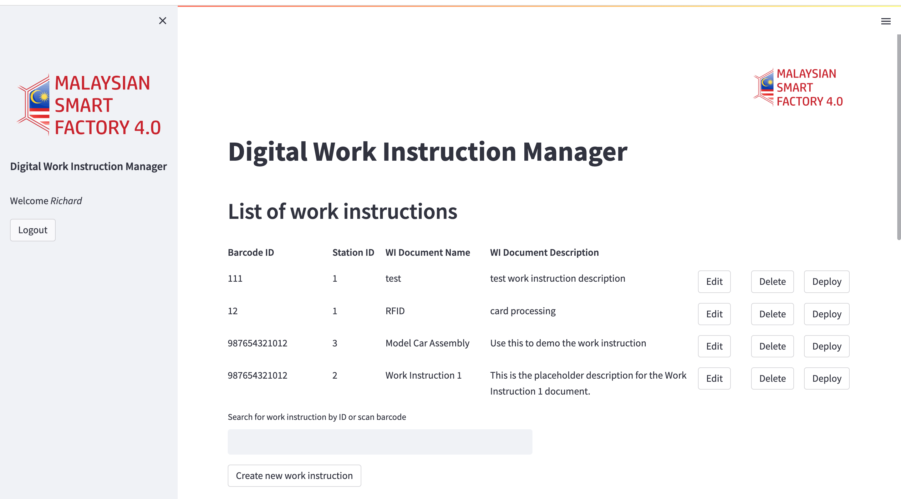

# work-instruction-create-and-deploy
Streamlit-based tools to create, edit and deploy step-by-step multimedia work instruction documents for the process line.

## implementation guide
1. [Install Python](https://www.python.org/downloads/) (Install or update to 3.12.1 or higher)
2. [Install MySQL](https://dev.mysql.com/downloads/installer/) (Take the 8.0.35 version or higher, do not download the web version, install the full version)
3. [Install PIP](https://www.geeksforgeeks.org/how-to-install-pip-on-windows/) (If pip is not found you need to go to the link, note that if you have downloaded Python 2.7. 9+ and Python 3.4+ you will have pip)
4. If Python or MySQL is not found in the command prompt you will need to add path to the system environment. (https://learn.microsoft.com/en-us/previous-versions/office/developer/sharepoint-2010/ee537574(v=office.14)) [Youtube](https://www.youtube.com/watch?v=Y2q_b4ugPWk)
5. Download the Work Instruction folder 
6. Open your terminal and navigate to the downloaded folder
7. Install all the App dependencies  
```console 
pip install -r requirements.txt
```  
8. Add username and password to your local app secrets  
  Your local Streamlit app will read secrets from a file .streamlit/secrets.toml in your app's root directory. Create this file if it doesn't exist yet and add the user, and password of your MySQL server as shown below:  
  ```console 
#.streamlit/secrets.toml

[mysql]
host = "localhost"
port = 3306
database = "wi"
user = "xxx"
password = "xxx"
```  

9. Create the required Database and Tables  
```console 
mysql -u root -p < database.txt
```  
10. Run the App  
```console 
streamlit run work_instruction_creator.py
```  

---  
<br/> 

## Credentials
### Admin
```console 
Username: admin  
Password: admin123
```  

### Instructor
```console 
Username: instructor  
Password: instructor123
```  

### Operator
```console 
Username: operator  
Password: operator123
```  

---  
<br/> 

## Features  
### Admin
- Create Work Instructions
- Edit Work Instructions
- Deploy Work Instructions
- Delete Work Instructions
- Filter Work Instructions
- Create Work Instruction Steps
- Edit Work Instruction Steps
- Delete Work Instruction Steps
- Send data to MQTT Broker through MQTT
- Receive data from MQTT Broker through MQTT
- Admin dashboard with Operator Access Control Panel and Operator parameters assignment Panel 

### Instructor
- Create Work Instructions
- Edit Work Instructions
- Deploy Work Instructions
- Delete Work Instructions
- Filter Work Instructions
- Create Work Instruction Steps
- Edit Work Instruction Steps
- Delete Work Instruction Steps
- Send data to MQTT Broker through MQTT
- Receive data from MQTT Broker through MQTT

### Operator
- Deploy Work Instructions
- Filter Work Instructions
- Send data to MQTT Broker through MQTT
- Receive data from MQTT Broker through MQTT

---  
<br/> 

## Demo  
#### **Click on image to watch the demo video** 
[](https://drive.google.com/file/d/1bUrmqlS7WzaUTkKL_JylFQr2rL43mqAh/view?usp=share_link)  
